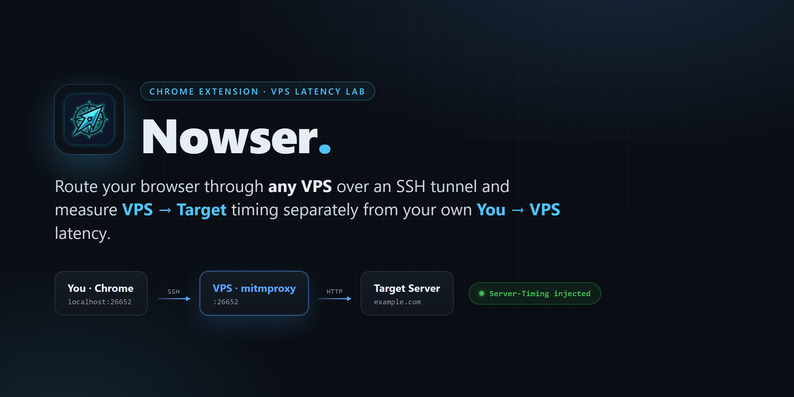
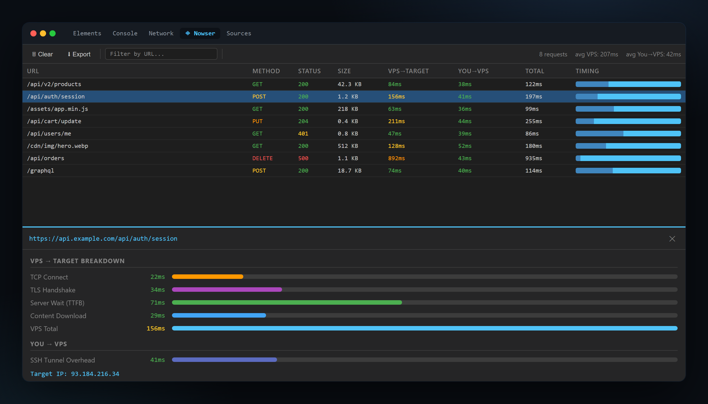
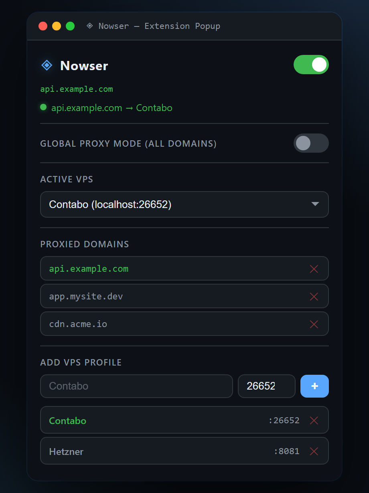

<div align="center">



<p>
  <a href="#quick-start"></a>
  
  
  
  
</p>

<b>Route your browser traffic through any VPS over an SSH tunnel — and measure<br><code>VPS → Target</code> timing separately from your own <code>You → VPS</code> latency.</b>

</div>

---

## Why Nowser?

When a page feels slow, the browser's Network tab can't tell you *where* the time went — your home connection, or the server itself. Nowser splits the two.

It routes your traffic through a VPS running [mitmproxy](https://mitmproxy.org/). The VPS measures how long **it** waited on the target server and injects that as a standard `Server-Timing` header. Your browser then subtracts VPS-side time from the total round-trip, leaving your own tunnel overhead. The result: a clean **server-side vs. you-side** breakdown for every request.

- 🌍 **Measure from anywhere** — see a site's latency as if you were sitting in your VPS's datacenter, not your living room.
- 🔬 **Isolate the server** — TCP connect, TLS handshake, TTFB and download, measured *at the VPS*, uncontaminated by your last-mile connection.
- 🎯 **Per-domain routing** — send only the domains you care about through the proxy; everything else stays direct.
- 🔀 **Multiple VPS profiles** — flip between Contabo, Hetzner, or any SSH host from a dropdown, each on its own port.
- 🛠 **Native DevTools panel** — a dedicated *Nowser* tab next to Console and Network, plus real `Server-Timing` entries in Chrome's own timing view.
- 📦 **One dependency, no sudo** — a single `.bat` sets up mitmproxy in a user-level venv on the VPS and opens the tunnel.

---

## How It Works

```
You (Chrome)  ──SSH Tunnel──▶  VPS (mitmproxy)  ──HTTP(S)──▶  Target Server
              localhost:26652        :26652                      example.com
                                       │
                                       ├─ Times TCP / TLS / TTFB / download  (VPS → Target)
                                       └─ Injects them as Server-Timing headers
```

The Chrome extension points your traffic at a local port that's SSH-forwarded to the VPS. A [mitmproxy](https://mitmproxy.org/) addon on the VPS times each request **from the VPS to the destination** and writes the numbers into a `Server-Timing` response header. The Nowser DevTools panel reads those headers and reconstructs the full picture:

> **You → VPS** overhead is *derived*: `total (browser) − VPS total`. It's the cost of your SSH tunnel, so you can see it — and mentally subtract it — separately from the server's own latency.

---

## Screenshots

<table>
<tr>
<td width="62%" valign="top">

**DevTools panel** — every request with a `VPS → Target` and `You → VPS` split, colour-coded timing, and a per-request breakdown (TCP connect, TLS, TTFB, download) with the resolved target IP.

</td>
<td width="38%" valign="top">

**Extension popup** — toggle the current domain, flip on global mode, and manage VPS profiles.

</td>
</tr>
<tr>
<td valign="top"></td>
<td valign="top"></td>
</tr>
</table>

---

## Quick Start

### 1. Prerequisites

- **SSH access** to your VPS with key-based auth configured in `~/.ssh/config`
- **Python 3** on the VPS
- **Chrome** (or any Chromium browser) on Windows

Your `~/.ssh/config` should have entries like:

```ssh-config
Host Contabo
    HostName 123.45.67.89
    User root
    IdentityFile ~/.ssh/id_ed25519

Host Hetzner
    HostName 98.76.54.32
    User root
    IdentityFile ~/.ssh/id_ed25519
```

> Nowser only ever refers to your hosts by their SSH **alias** (`Contabo`, `Hetzner`) — it never touches IPs or keys directly.

### 2. Connect a VPS

Double-click **`nowser.bat`** (or run it with arguments):

```bat
nowser.bat
:: or non-interactively:
nowser.bat Contabo 26652
```

It will:

1. ✅ Install mitmproxy on the VPS at `~/nowser/` in a user-level venv (no sudo; skips if already present)
2. ✅ Upload the proxy script (`nowser_proxy.py`) and start script via SCP — only when changed
3. ✅ Start / restart `mitmdump` on the VPS, listening on `:26652`
4. ✅ Download the mitmproxy CA cert and **auto-install it into the Windows trust store**
5. ✅ Open the SSH tunnel (`localhost:26652 → VPS:26652`) and hold it open until you press **Ctrl+C**

> **Multiple VPS at once** — run more instances on different local ports:
> ```bat
> nowser.bat Contabo 26652
> nowser.bat Hetzner 8081
> ```

### 3. Install the Chrome Extension

1. Open `chrome://extensions/`
2. Enable **Developer mode** (top-right)
3. Click **Load unpacked** → select the `extension/` folder
4. Pin the Nowser extension to your toolbar

### 4. Configure & Route

Click the Nowser icon:

1. **Add a VPS profile** — enter a name (e.g. `Contabo`) and port (e.g. `26652`) → click **+**
2. **Pick the active VPS** from the dropdown
3. **Route traffic**, either:
   - **Per-domain** — flip the top toggle while on a site to route *just that domain* (everything else stays direct), or
   - **Global** — flip **Global Proxy Mode** to send *all* traffic through the VPS

The toolbar badge shows what's routed: **`ON`** for the current domain, a **count** of proxied domains, or **`ALL`** in global mode.

### 5. View Timing Data

1. Open DevTools (**F12**)
2. Go to the **Nowser** tab (next to Console, Network, …)
3. Browse normally — each request shows:
   - **VPS → Target** — time from the VPS to the destination server
   - **You → VPS** — SSH tunnel overhead (derived)
   - **Total** — full round-trip from your browser
   - Click any row for the full breakdown (TCP connect, TLS, TTFB, download, target IP)
   - **Export** the captured requests as JSON, or **Filter** by URL

The same numbers also appear natively in Chrome's **Network → Timing** section, since Nowser emits standard `Server-Timing` entries.

---

## HTTPS & the CA Certificate

To time HTTPS requests, mitmproxy must terminate TLS at the VPS, which means your browser has to trust its CA certificate.

On **Windows, `nowser.bat` handles this automatically** — it downloads the cert to `certs/<alias>-ca-cert.pem` and adds it to your user trust store on first connect. Just **restart Chrome** afterwards.

If auto-install fails, or you're on another OS, install it manually:

```bash
scp Contabo:~/.mitmproxy/mitmproxy-ca-cert.pem .
```

Then import the `.pem` into **Trusted Root Certification Authorities** (Chrome → Settings → Privacy & Security → Security → Manage certificates) and restart the browser.

> ⚠️ **Only do this for a VPS you control and trust.** The CA cert lets mitmproxy decrypt your HTTPS traffic in order to time it. The certs are machine-specific and are **git-ignored** — they never belong in a repo.

---

## Server-Timing Metrics

The VPS proxy injects these into every response:

| Metric | Description |
|--------|-------------|
| `vps-connect`  | TCP connection time (VPS → Target) |
| `vps-tls`      | TLS handshake duration |
| `vps-wait`     | Server processing time / TTFB |
| `vps-download` | Response body transfer time |
| `vps-total`    | Total time from the VPS's perspective |

It also adds `X-Nowser-Target-IP` (the resolved destination IP, handy for CDN/geo debugging) and exposes both via `Access-Control-Expose-Headers` so the panel can read them cross-origin.

---

## Project Structure

```
Nowser/
├── nowser.bat                  # One-click VPS connector (Windows)
├── vps-proxy/
│   ├── nowser_proxy.py         # mitmproxy addon — runs on the VPS, injects Server-Timing
│   ├── start.sh                # Starts/restarts mitmdump on the VPS
│   └── requirements.txt        # mitmproxy
├── extension/
│   ├── manifest.json           # Chrome MV3 manifest
│   ├── background.js           # Proxy management (PAC script) service worker
│   ├── popup.html / .js / .css # Extension popup UI
│   ├── devtools.html / .js     # DevTools panel registration
│   ├── panel.html / .js / .css # Timing breakdown panel
│   └── logo.png                # Extension icon
├── assets/                     # README images
└── README.md
```

---

## Troubleshooting

| Problem | Solution |
|---------|----------|
| `ERR_PROXY_CONNECTION_FAILED` | Tunnel isn't running. Start it with `nowser.bat`. |
| HTTPS errors / cert warnings | Install the mitmproxy CA cert and restart Chrome (see [HTTPS](#https--the-ca-certificate)). |
| Extension not routing | Check a profile is selected, and either the domain toggle or Global Mode is ON. |
| Tunnel keeps disconnecting | SSH idle timeout — add `ServerAliveInterval 60` to your `~/.ssh/config`. |
| Port already in use | Another tunnel holds it. Use a different local port. |
| No timing data in the panel | The request didn't go through the proxy. Verify with `curl -x localhost:26652 http://example.com -v`. |

---

## How the Pieces Fit

- **`nowser.bat`** provisions the VPS, opens the SSH tunnel, and manages the CA cert — the only thing you run.
- **`vps-proxy/nowser_proxy.py`** is a ~90-line mitmproxy addon: on each response it reads mitmproxy's own connection timestamps and writes them back as `Server-Timing`.
- **`extension/background.js`** builds a PAC script so only your chosen domains (or everything, in global mode) hit the tunnel.
- **`extension/panel.js`** listens to `chrome.devtools.network.onRequestFinished`, parses the injected headers, and renders the breakdown.

---

## License

[MIT](LICENSE) © juanpe500

<div align="center"><sub>Built with mitmproxy · Chrome MV3 · a single SSH tunnel</sub></div>
